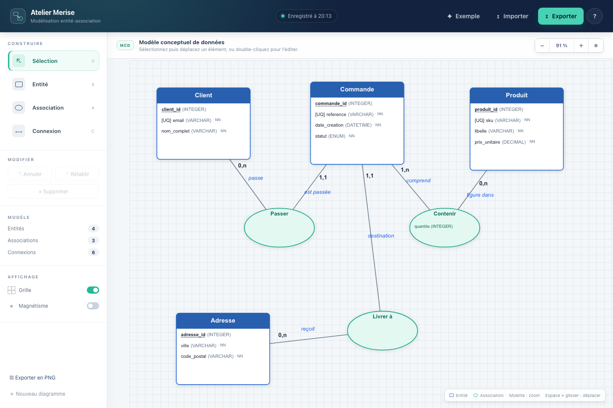

# Atelier Merise

Atelier Merise est un éditeur visuel de modèles conceptuels de données (MCD), utilisable directement dans le navigateur. Il permet de construire un diagramme entité-association, de préciser les cardinalités et les attributs, puis d’exporter le résultat en JSON ou en PNG.

**Application :** [zhauyoung.com/er-diagram-editor](https://zhauyoung.com/er-diagram-editor/)



## Fonctionnalités

- Entités avec attributs typés, clé primaire, unicité, nullabilité, valeur par défaut et valeurs `ENUM` / `SET`.
- Associations binaires, n-aires et réflexives avec cardinalités `0,1`, `1,1`, `0,n` et `1,n`.
- Déplacement, sélection multiple, duplication, grille magnétique, zoom et déplacement du canevas.
- Historique annuler / rétablir fondé sur des commandes réversibles.
- Sauvegarde automatique locale, sans compte et sans envoi du diagramme à un serveur.
- Import et export JSON validés, plus export PNG haute définition.
- Modèle d’exemple prêt à explorer et interface adaptée aux petits écrans.

## Démarrage local

Prérequis : Node.js 20 ou une version plus récente.

```bash
npm install
npm run dev
```

Vite sert l’application sous `/er-diagram-editor/`, comme en production. Pour utiliser un autre chemin de base :

```bash
ER_DIAGRAM_BASE_PATH=/ npm run dev
```

## Vérification et construction

```bash
npm run check
```

Cette commande exécute les tests du modèle de données, de la validation d’import et de l’historique, puis produit le site statique dans `dist/`.

```bash
npm run preview
```

## Architecture

```text
index.html          Structure accessible de l’atelier
style.css           Système visuel et mise en page responsive
js/
  app.js            Interactions et coordination de l’interface
  commands.js       Commandes réversibles pour l’historique
  config.js         Dimensions, couleurs, types et cardinalités
  example.js        Modèle e-commerce de démonstration
  modals.js         Éditeurs d’entités et d’associations
  models.js         Objets du domaine
  renderer.js       Rendu et navigation Konva
  state.js          État, validation, sérialisation et persistance
  utils.js          Utilitaires de géométrie et de formatage
tests/              Tests Node.js sans navigateur
```

L’application est volontairement locale-first. `localStorage` conserve le dernier modèle dans le navigateur ; l’export JSON reste le format portable et auditable.

## Format JSON

Le document exporté contient une version de format et trois collections :

```json
{
  "version": 1,
  "entities": [],
  "associations": [],
  "connections": []
}
```

À l’import, les identifiants, types SQL, coordonnées, cardinalités et références entre collections sont contrôlés avant de remplacer le modèle courant.
